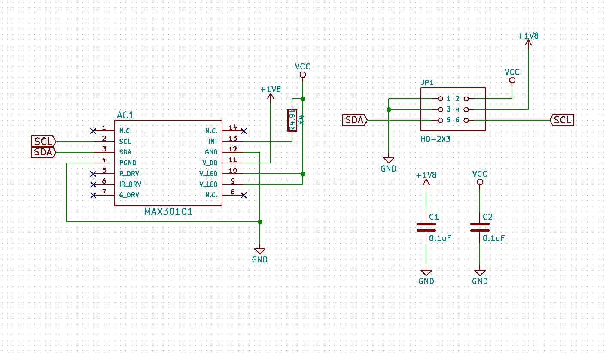
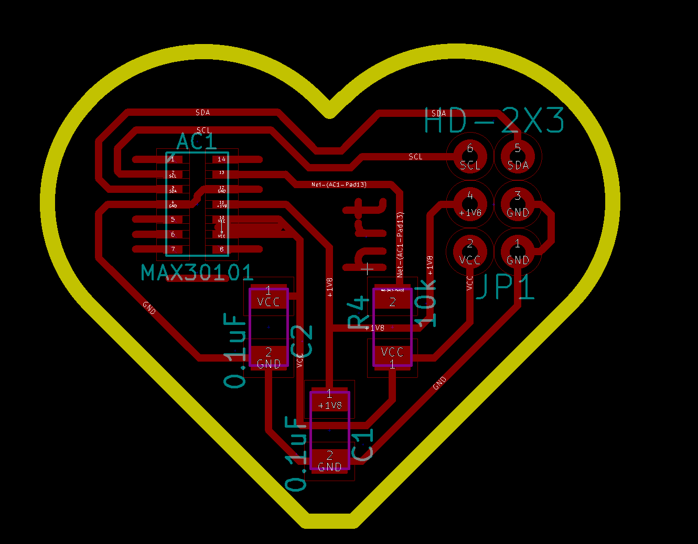
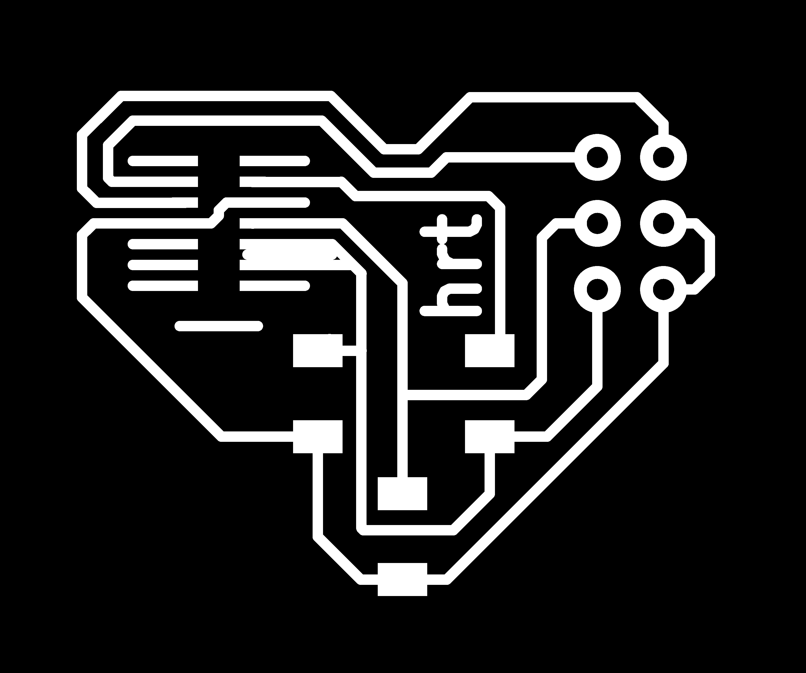

# Privacy Seed - Heart rate sensor board

KiCAD custom heart rate board based on MAX30101 to connect to a [Arduino Nano shield](https://github.com/iliasbartolini/privacy-seed-heartrate-sensor-nano-shield).
This component is part of the [Privacy Seed](https://privacy-seed.org/) project.

## Schema

## PCB

